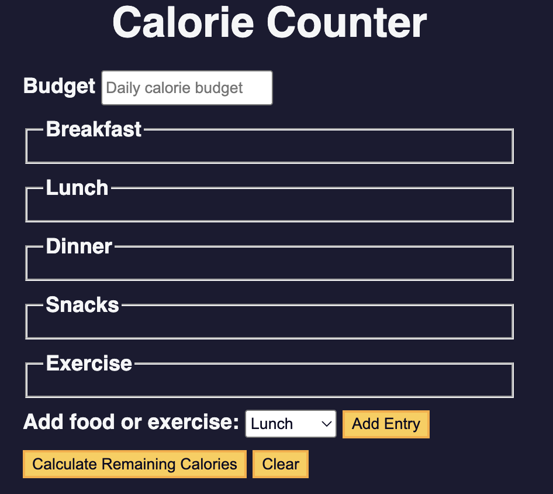

# 🥗🔥 Calorie Calculator
A **simple Calorie Calculator** built with HTML, CSS, and JavaScript. 

## 📌 Overview
The Calorie Calculator is a simple, interactive web application that allows users to enter their meals and exercises to calculate net calories and determine whether they are in a caloric surplus or deficit. This tool is designed to help users track their daily energy intake and make more informed decisions about their diet and fitness goals.

Beyond its practical functionality, this project demonstrates core front-end development skills, including:

- Form handling and input validation to ensure accurate user input

- DOM manipulation to dynamically update the page based on user interactions

- Conditional logic and real-time calculations to provide immediate feedback

This project is ideal for anyone looking to practice JavaScript fundamentals while building a small but meaningful web application that solves a real-world problem in a clear and user-friendly way.

---

## 🛠 Problems Solved / Why This Matters

- 🥘 Helps users track daily caloric intake easily

- ⚡ Provides instant feedback on energy surplus/deficit

- 💻 Demonstrates front-end skills like form handling, validation, and DOM updates

- 🔄 Shows practical use of JavaScript logic and conditionals

## 🚀 Features

- Input calories for **breakfast, lunch, dinner, snacks, and exercise**  
- Calculates **net calories**  
- Displays whether the user is in a **Surplus** or **Deficit**  
- Basic **input validation**  

---

## 📂 Technologies Used

- **HTML5**  
- **CSS3**  
- **JavaScript (ES6+)**  
- **DOM manipulation**

---

## 📦 How to Run
1. Click on the "Try it here" button below to open the live demo.

     **Live Demo:** [Try it here](https://sarahborgelt.github.io/CalorieCalculator/)  
     **Source Code:** [GitHub Repository](https://github.com/sarahborgelt/calorie-calculator)

## 🧠 Lessons Learned

- Working with HTML forms and input validation

- DOM manipulation and updating content dynamically

- Building a functional, interactive front-end application